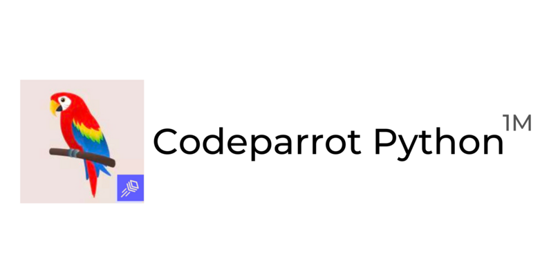
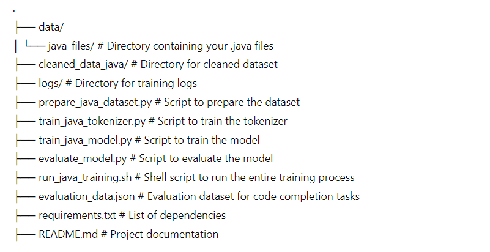

# A Naturalness-based Approach For codecompletionmodels to distinguish CTdata and CLdata

# Code Completion with UniXcoder

This repository contains scripts and instructions for training a RoBERTa-based model to complete Java code. UniXcoder use RoBERTa-based model. The project involves preprocessing Java files, training the model, and evaluating it on incomplete code snippets.

## Table of Contents

- [Prerequisites](#prerequisites)
- [Installation](#installation)
- [Usage](#usage)
  - [1. Convert Java Files to Text](#1-convert-java-files-to-text)
  - [2. Preprocess Text Files](#2-preprocess-text-files)
  - [3. Train the Model](#3-train-the-model)
  - [4. Evaluate the Model](#4-evaluate-the-model)
  - [5. Test the Model](#5-test-the-model)
- [Scripts](#scripts)
  - [java_to_txt.py](#java_to_txtpy)
  - [preprocess.py](#preprocesspy)
  - [run.py](#runpy)
- [License](#license)

## Prerequisites

- Python 3.6 or higher
- PyTorch
- Transformers (HuggingFace)
- tqdm
- javalang
- Other dependencies as listed in `requirements.txt`

## Installation

1. Clone the repository:
    ```sh
    git clone https://github.com/naturalnessbasedappraoch/A-naturalnessbasedappraoch-for-Contamination-Detection-.git
    cd UniXcoder
    ```

2. Install the required packages:
    ```sh
    pip install -r requirements.txt
    ```

## Usage

### 1. Convert Java Files to Text

Convert Java files into a single text file with the `java_to_txt.py` script.

```sh
python java_to_txt.py --input_dir path/to/java/files --output_file train.txt
```
### 2. Preprocess Text Files
Preprocess the text files to tokenize and format the data using preprocess.py.
```sh
python preprocess.py --base_dir . --output_dir preprocessed_data
```
### 3. Train the Model
Train the model using the run.py script. Make sure to specify the directories containing the preprocessed files
```sh
python run.py --output_dir output --train_dir preprocessed_data --dev_dir preprocessed_data --do_train --train_batch_size 8 --num_train_epochs 3
```
### 4. Evaluate the Model
Evaluate the model on the validation set.
```sh
python run.py --output_dir output --dev_dir preprocessed_data --do_eval --eval_batch_size 8
```
### 5. Test the Model
Test the model with incomplete code snippets.
```sh
python run.py --output_dir output --test_dir preprocessed_data --test_output test_output.txt --do_test --eval_batch_size 8
```
## Scripts
### java_to_txt.py
This script converts .java files to a single .txt file, formatting the content appropriately.
```sh
python java_to_txt.py --input_dir path/to/java/files --output_file output.txt
```
###run.py
This script handles the training, evaluation, and testing of the RoBERTa-based model.

Arguments:

--output_dir: Directory to save model checkpoints and outputs.
--train_dir: Directory containing preprocessed training data.
--dev_dir: Directory containing preprocessed validation data.
--test_dir: Directory containing preprocessed test data.
--test_output: File containing expected outputs for testing.
--max_source_length: Maximum sequence length for input.
--max_target_length: Maximum sequence length for target.
--do_train: Flag to enable training.
--do_eval: Flag to enable evaluation.
--do_test: Flag to enable testing.
--train_batch_size: Batch size for training.
--eval_batch_size: Batch size for evaluation and testing.
--learning_rate: Learning rate for the optimizer.
--num_train_epochs: Number of training epochs.
--gradient_accumulation_steps: Gradient accumulation steps.
--no_cuda: Flag to disable CUDA.
--seed: Random seed for initialization.
```sh
python run.py --output_dir output --train_dir preprocessed_data --dev_dir preprocessed_data --test_dir preprocessed_data --test_output test_output.txt --do_train --do_eval --do_test --train_batch_size 8 --eval_batch_size 8 --num_train_epochs 3
```

# Code completion with Codeparrot



This repository contains scripts to train and evaluate a Java code completion model using GPT-2 architecture. The project is divided into four main parts: dataset preparation, tokenizer training, model training, and model evaluation.

## Table of Contents

- [Directory Structure](#directory-structure)
- [Setup](#setup)
  - [1. Clone the Repository](#1-clone-the-repository)
  - [2. Create a Virtual Environment and Install Dependencies](#2-create-a-virtual-environment-and-install-dependencies)
  - [3. Place Java Files](#3-place-java-files)
- [Usage](#usage)
  - [1. Prepare the Dataset](#1-prepare-the-dataset)
  - [2. Train the Tokenizer](#2-train-the-tokenizer)
  - [3. Train the Model](#3-train-the-model)
  - [4. Evaluate the Model](#4-evaluate-the-model)

## Directory Structure





## Setup

1. **Clone the Repository**: Clone the repository and navigate to the project directory.

    ```sh
    git clone https://github.com/yourusername/java-code-completion.git
    cd java-code-completion
    ```

2. **Create a Virtual Environment and Install Dependencies**: Create a virtual environment and install the required dependencies.

    ```sh
    python -m venv venv
    source venv/bin/activate
    pip install -r requirements.txt
    ```

3. **Place Java Files**: Place your `.java` files in the `data/java_files` directory.

## Usage

### 1. Prepare the Dataset
```sh
Run the dataset preparation script to read `.java` files, remove duplicates, and save the contaminated dataset

python prepare_java_dataset.py
```
### 2. Train the Tokenizer
```sh
Train a new tokenizer using the contaminated dataset.
python train_java_tokenizer.py
```
### 3. Train the Model
```sh
Train the language model using the tokenizer and dataset.
python train_java_model.py --output_dir codeparrot_java_model --num_train_epochs 3 --per_device_train_batch_size 4 --save_steps 1000 --eval_steps 1000 --logging_dir logs
```
```sh
Alternatively, you can use the shell script to run the entire process:
bash run_java_training.sh
```
### 4. Evaluate the Model
```sh
Evaluate the trained model on both datasets(contaminated and cleaned).
python evaluate_model.py
```

