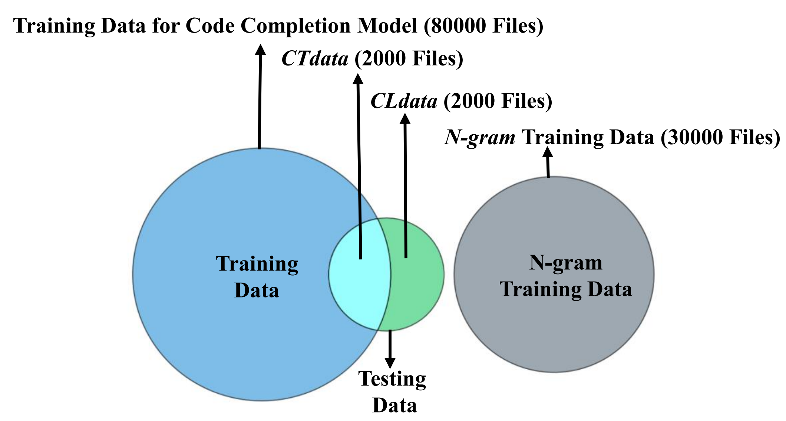

# Has My Code Been Stolen for Model Training? A Naturalness-Based Approach to Code Contamination Detection
```


```

This repository contains the code, datasets, and resources for the research paper **"Has My Code Been Stolen for Model Training? A Naturalness-Based Approach to Code Contamination Detection"**. The proposed method, **Natural-DaCoDe**, uses naturalness scores of source code to detect whether a given piece of code has been used to train deep learning models, particularly code completion models.

## Project Overview
The objective of this project is to provide a novel approach to detecting data contamination in deep learning models. By leveraging the **naturalness** of source code and combining it with the model’s performance, this approach significantly outperforms traditional methods for detecting whether a piece of code has been used for model training.

### Key Contributions:
- **Naturalness-Based Detection**: Quantitatively measures code naturalness to assess how difficult a code snippet is to predict.
- **Classifier Approach**: Uses an SVM-based classifier trained on both naturalness and performance metrics for contamination detection.
- **Evaluated on Large Models**: The approach is evaluated with both open-source models like **UniXcoder** and **CodeParrot**, as well as large pre-trained models like **ChatGPT** and **Claude**.

## Features
- Detection of contaminated vs. cleaned datasets using naturalness and model performance.
- Works for code completion models and method name suggestion tasks.
- Provides significant improvements over state-of-the-art approaches like **LOSS Attack** and **Min-K% Prob**.
- Code and dataset collection for constructing contaminated (𝐶𝑇𝑑𝑎𝑡𝑎) and cleaned (𝐶𝐿𝑑𝑎𝑡𝑎) datasets.


# Dataset for Code Completion and N-gram Models
<p align="center">
    
</p>


This folder contains all the datasets used for training and testing the models in the paper **"Has My Code Been Stolen for Model Training? A Naturalness-Based Approach to Code Contamination Detection"**. The dataset is organized into three main parts: **Train Dataset**, **Testing Dataset**, and **N-gram Train Dataset**.

## Folder Structure
```plaintext
dataset/
│
├── Train Dataset (for Code Completion Model)
│   ├── UniXcoder Training Data
│   │   ├── file1.java
│   │   ├── file2.java
│   │   └── ...
│   └── CodeParrot Training Data
│       ├── file1.java
│       ├── file2.java
│       └── ...
│
├── N-gram Train Dataset (for N-gram Model)
│   ├── file1.java
│   ├── file2.java
│   └── ...
│
└── Test Dataset (for N-gram Model)
    ├── ChatGPT3.5, Claude, UniXcoder and CodeParrot Data
    │   ├── CLdata
    │   │   ├── file1.java
    │   │   ├── file2.java
    │   │   └── ...
    │   └── CTdata/
    │       ├── file1.java
    │       ├── file2.java
    │       └── ...
└── Test Dataset (for Code Completion Models)
    ├── ChatGPT3.5 and Claude
    │   ├── CLdata
    │   │   ├── file1.java
    │   │   ├── file2.java
    │   │   └── ...
    │   └── CTdata
    │       ├── file1.java
    │       ├── file2.java
    │       └── ...
    ├── UniXcoder and CodeParrot
            ├── CLdata.json
            ├── CTdata.json
```
### 1. Train Dataset (for Code Completion Model)
This folder contains the training datasets for two different code-completion models: **UniXcoder** and **CodeParrot**.


- **`UniXcoder/CodeParrot Training Data`**: 
    - Contains Java files that are used to train the UniXcoder model.
    - Example files: `file1.java`, `file2.java`, etc.
    
### 2. `Train Dataset (for N-gram Model)`
This folder contains the data used to train the n-gram model. It includes various Java files:

- Example files: `file1.java`, `file2.java`, etc.


### 3. `Test Dataset (for Code Completion and Ngram Models)`

This folder contains the test datasets for both **(UniXcoder** and **CodeParrot)** models and Pretrain models **(ChatGPT3.5 and Claude)**. The test data is split into two categories:

- **`CLdata/`** (Cleaned Data):
    - Contains clean Java files that were not part of the model training data.
    - Example files: `file1.java`, `file2.java`, etc.
  
- **`CTdata/`** (Contaminated Data):
    - Contains Java files that were part of the model training data.
    - Example files: `file1.java`, `file2.java`, etc.


## Usage Instructions

- **Train Dataset**: Use the files in the `Train Dataset (for Code Completion Model)` folder for training the UniXcoder and CodeParrot models.
- **N-gram Train Dataset**: The `N-gram Train Dataset` folder contains the data required to train an n-gram model, which is used for code naturalness evaluation.
- **Test Dataset**: To evaluate, use the files in the `Test Dataset for Code Completion Models(UniXcoder, CodeParrot, ChatGPT3.5 and Claude) and Ngram Model`. The `CLdata` folder contains clean test data, while the `CTdata` folder contains contaminated test data.


## Preprocessing

If needed, the datasets can be preprocessed using scripts found in the `src/` folder of the repository (e.g., for tokenizing the Java files or cleaning the data).

Due to size limits, the dataset has been uploaded to Google Drive. You can download the dataset using the following link:

- [Download Dataset from Google Drive](https://drive.google.com/file/d/17K12pXvbPytSzSRPzBlPK6GfulJHsbWg/view?usp=sharing)

## License


This dataset is shared under the MIT license. For more details, refer to the `LICENSE` file in the main repository.

## Acknowledgements

Please cite the paper **"Has My Code Been Stolen for Model Training? A Naturalness-Based Approach to Code Contamination Detection"** if you use this dataset in your work.
