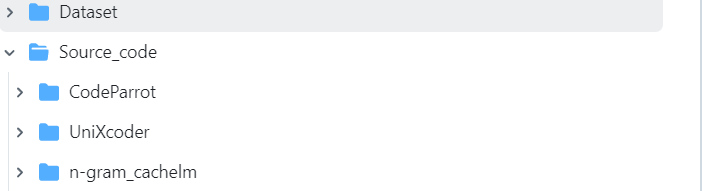

# Replication package for paper "Has My Code Been Stolen for Model Training? A Naturalness-Based Approach to Code Contamination Detection"


This repository contains the code, datasets, and resources for the research paper **"Has My Code Been Stolen for Model Training? A Naturalness-Based Approach to Code Contamination Detection"**. The proposed method, **Natural-DaCoDe**, uses naturalness scores of source code to detect whether a given piece of code has been used to train deep learning models, particularly code completion models.

## Project Overview
The objective of this project is to provide a novel approach to detecting data contamination in deep learning models. By leveraging the **naturalness** of source code and combining it with the model’s performance, this approach significantly outperforms traditional methods for detecting whether a piece of code has been used for model training.
## Features
- Detection of contaminated vs. cleaned datasets using naturalness and model performance.
- Works for code completion models and method name suggestion tasks.
- Code and dataset collection for constructing contaminated (𝐶𝑇𝑑𝑎𝑡𝑎) and cleaned (𝐶𝐿𝑑𝑎𝑡𝑎) datasets.

## Directory Structure

This section provides an overview of the repository structure, including datasets, and the source code of the Code Completion models: [Dataset](https://drive.google.com/file/d/17K12pXvbPytSzSRPzBlPK6GfulJHsbWg/view?usp=sharing),[UniXcoder](https://github.com/naturalnessbasedappraoch/Natural-DaCode/tree/main/Source_code/UniXcoder), [CodeParrot](https://github.com/naturalnessbasedappraoch/Natural-DaCode/tree/main/Source_code/CodeParrot), and [Ngram Model](https://github.com/naturalnessbasedappraoch/Natural-DaCode/tree/main/Source_code/n-gram_cachelm).


# Dataset for Code Completion and N-gram Models
<p align="center">
    
</p>


This folder contains all the datasets used for training and testing the models in the paper **"Has My Code Been Stolen for Model Training? A Naturalness-Based Approach to Code Contamination Detection"**. The dataset is organized into three main parts: **Train Dataset**, **Testing Dataset for Code Completion Models**, and **N-gram Train Dataset**.

## Folder Structure
```plaintext
dataset/
│
├── Train Dataset (for Code Completion Model)
│   ├── UniXcoder Training Data
│   │   ├── file1.java
│   │   ├── file2.java
│   │   └── ...
│   └── CodeParrot Training Data
│       ├── file1.java
│       ├── file2.java
│       └── ...
│
├── N-gram Train Dataset (for N-gram Model)
│   ├── file1.java
│   ├── file2.java
│   └── ...
│
└── Test Dataset (for N-gram Model)
    ├── ChatGPT3.5, Claude, UniXcoder and CodeParrot Data
    │   ├── CLdata
    │   │   ├── file1.java
    │   │   ├── file2.java
    │   │   └── ...
    │   └── CTdata/
    │       ├── file1.java
    │       ├── file2.java
    │       └── ...
└── Test Dataset (for Code Completion Models)
    ├── ChatGPT3.5 and Claude
    │   ├── CLdata
    │   │   ├── file1.java
    │   │   ├── file2.java
    │   │   └── ...
    │   └── CTdata
    │       ├── file1.java
    │       ├── file2.java
    │       └── ...
    ├── UniXcoder and CodeParrot
            ├── CLdata.json
            ├── CTdata.json
```
## Download Dataset

Due to size limits, the dataset has been uploaded to Google Drive. You can download the dataset using the following link:

- [Download Dataset from Google Drive](https://drive.google.com/file/d/17K12pXvbPytSzSRPzBlPK6GfulJHsbWg/view?usp=sharing)
  
### 1. Train Dataset (for Code Completion Model)
This folder contains the training datasets for two different code-completion models: **UniXcoder** and **CodeParrot**.


- **`UniXcoder/CodeParrot Training Data`**: 
    - Contains Java files that are used to train the UniXcoder model.
    - Example files: `file1.java`, `file2.java`, etc.
    - For details on training these models, refer to the respective repositories:
        - [UniXcoder](https://github.com/naturalnessbasedappraoch/Natural-DaCode/tree/main/Source_code/UniXcoder)
        - [CodeParrot](https://github.com/naturalnessbasedappraoch/Natural-DaCode/tree/main/Source_code/CodeParrot)
    
### 2. `Train Dataset (for N-gram Model)`
This folder contains the data used to train the n-gram model. It includes various Java files:

- Example files: `file1.java`, `file2.java`, etc.
To train the N-gram model, you can use the code provided in the [Ngram Model](https://github.com/naturalnessbasedappraoch/Natural-DaCode/tree/main/Source_code/n-gram_cachelm) repository. Follow the instructions in the repository to preprocess the data and train the model.


### 3. `Test Dataset (for Code Completion and Ngram Models)`

This folder contains the test datasets for **(UniXcoder** and **CodeParrot)** and pre-trained models **(ChatGPT3.5 and Claude)**. The test data is split into two categories:

- **`CLdata/`** (Cleaned Data):
    - Contains clean Java files that were not part of the model training data.
    - Example files: `file1.java`, `file2.java`, etc.
  
- **`CTdata/`** (Contaminated Data):
    - Contains Java files that were part of the model training data.
    - Example files: `file1.java`, `file2.java`, etc.


## Usage Instructions

- **Train Dataset**: Use the files in the `Train Dataset (for Code Completion Model)` folder for training the UniXcoder and CodeParrot models.
- **N-gram Train Dataset**: The `N-gram Train Dataset` folder contains the data required to train an n-gram model, which is used for code naturalness evaluation.
- **Test Dataset**: To evaluate, use the files in the `Test Dataset for Code Completion Models(UniXcoder, CodeParrot, ChatGPT3.5 and Claude) and Ngram Model`. The `CLdata` folder contains clean test data, while the `CTdata` folder contains contaminated test data.


## Steps for Contamination Detection

### 1. **Code Token-Level Accuracy**
- **Performance and Naturalness:**
  - **Performance:** Calculate the token-level accuracy from Code Completion Models.
  - **Naturalness:** Evaluate the naturalness scores for these snippets using the N-gram model.

### 2. **Train the Classifier**
- Combine the computed performance metrics and naturalness scores with the corresponding java file names.
- Use these combined inputs to train an SVM classifier. The inputs for training will include:
  - `Performance`
  - `Naturalness`

### 3. **Predict Contamination Source**
- The trained SVM classifier can then predict whether a given code comes from the contaminated dataset (`CTdata`) or the cleaned dataset (`CLdata`).

### 4. **Usage**
- To perform contamination detection, for the code completion model, use the script `Classifier_performance.py`, and for the method name Prediction, use the script 'classifier_methodname.py' available in the repository. This script handles the SVM classifier's training and the source dataset's prediction for new code samples.


