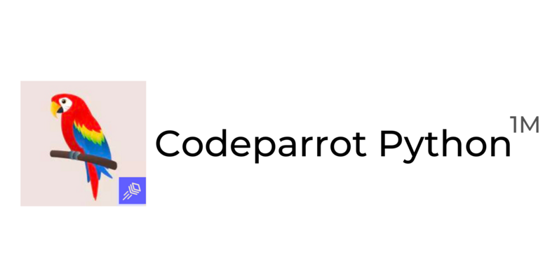

# Code Completion with Codeparrot


This repository contains scripts to train and evaluate a Java code completion model using the CodeParrot architecture. The project involves dataset preparation, tokenizer training, model training, and evaluation.

## Table of Contents
- [Directory Structure](#directory-structure)
- [Setup](#setup)
  - [1. Clone the Repository](#1-clone-the-repository)
  - [2. Create a Virtual Environment and Install Dependencies](#2-create-a-virtual-environment-and-install-dependencies)
  - [3. Place Java Files](#3-place-java-files)
- [Usage](#usage)
  - [1. Prepare the Dataset](#1-prepare-the-dataset)
  - [2. Train the Tokenizer](#2-train-the-tokenizer)
  - [3. Train the Model](#3-train-the-model)
  - [4. Evaluate the Model](#4-evaluate-the-model)
- [License](#license)

## Directory Structure

The project uses the following directory structure:
- `data/java_files`: Directory to place the `.java` files.
- `scripts`: Contains scripts for dataset preparation, training, and evaluation.
- `logs`: Stores training logs.
- `codeparrot_java_model`: Stores the saved models after training.

## Setup

### 1. Clone the Repository
1. **Clone the Repository**: Clone the repository and navigate to the project directory.

    ```sh
    git clone https://github.com/naturalnessbasedappraoch/Natural-DaCode.git
    cd Natural-DaCode/Source_code/CodeParrot
    ```

2. **Create a Virtual Environment and Install Dependencies**: Create a virtual environment and install the required dependencies.

    ```sh
    python -m venv venv
    source venv/bin/activate
    pip install -r requirements.txt
    ```

3. **Place Java Files**: Place your `.java` files in the `data/java_files` directory.

## Usage

### 1. Prepare the Dataset
```sh
Run the dataset preparation script to read `.java` files, remove duplicates, and save the Training dataset

python prepare_java_dataset.py
```
### 2. Train the Tokenizer
```sh
Train a new tokenizer using the Training dataset.
python train_java_tokenizer.py
```
### 3. Train the Model
```sh
Train the language model using the tokenizer and dataset.
python train_java_model.py \
  --output_dir codeparrot_java_model \
  --num_train_epochs 10 \
  --per_device_train_batch_size 8 \
  --save_steps 500 \
  --eval_steps 500 \
  --logging_dir logs \
  --learning_rate 5e-5 \
  --gradient_accumulation_steps 4

```
```sh
Alternatively, you can use the shell script to run the entire process:
bash run_java_training.sh
```
### 4. Evaluate the Model
```sh
Evaluate the trained model on both datasets(contaminated and cleaned).
python evaluate_model.py
```

